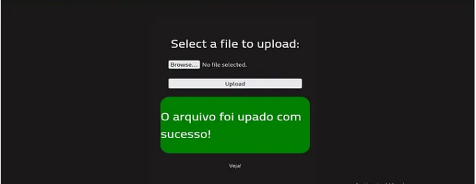
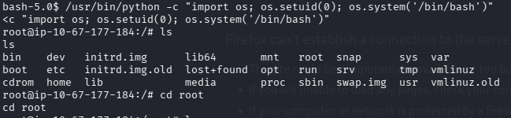
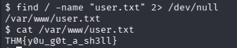
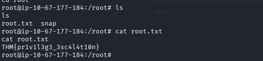

# Nome da Room
RootMe

## Objetivo
Upload de arquivos, enumeração web e privilege escalation

## Ambiente
- Plataforma: TryHackMe
- Categoria: Web / Linux / privilege escalation
- Dificuldade: Easy

## Metodologia

### 1. Enumeração
- O que eu fiz primeiro?

Bom primeiro eu fiz um nmap basico para ver o que esse ip:10.67.177.184 estava rodando.
- Quais ferramentas utilizei?
  
Nmap

- O que encontrei?
  

### 2. Enumeração Web
 - Por que decidiu usar Gobuster?
   
Bom estou acostumado a usar o Gobuster para fazer força bruta em diretoris mas eu poderia ter usado outros tambem.

 - Quais diretórios encontrou?
   
Termina o Gobuster devolvendo 4 diretorios uploads, css, js, panel

 - Qual deles foi importante?

   

O diretorio Panel, porque da para fazer uploads de arquivo e o diretorio upladoas por que consegue acessar o upload que eu mesmo fiz.

### 3. Exploração
- Qual vulnerabilidade identifiquei?
  
Upload irrestrito de arquivos(Unrestricted File Upload / Unrestricted File Upload Vulnerability)

- Como cheguei nela?
  
O formulário de upload permitia o envio de arquivos com a extensão .phtml. Como essa extensão era interpretada pelo servidor como PHP, foi possível fazer upload de um payload de shell reverso.

- Quais comandos utilizei?
  
Para conectar usei o nc -lvnp 4444 para escutar na porta 4444

### 4. Pós-exploração
- Como consegui mais informações?
  
Foi utilizado Python para spawn de um pseudo-terminal (pty.spawn('/bin/bash')), convertendo o shell reverso inicial em um shell mais interativo e estável, permitindo melhor controle do sistema.

- Houve escalonamento de privilégios?
  
Sim, Após obter acesso inicial ao sistema, foi realizada uma tentativa de escalonamento de privilégios utilizando Python. O interpretador Python foi usado para redefinir o UID do processo para 0 (root) e iniciar um shell interativo usando esse comando: python -c "import os; os.setuid(0); os.system('/bin/bash')"

## Flags
- Onde está a user flag e qual o seu valor?
  
 A user flag foi encontrada no diretório /var/www/ após enumeração do sistema. 
	THM{y0u_g0t_a_sh3ll}

-Onde está a root flag e qual o seu valor?

 Após a escalada de privilégios para root, a flag foi localizada no diretório /root.
	THM{pr1v1l3g3_3sc4l4t10n}

## Ferramentas utilizadas
- Nmap
- Gobuster
- NetCat
